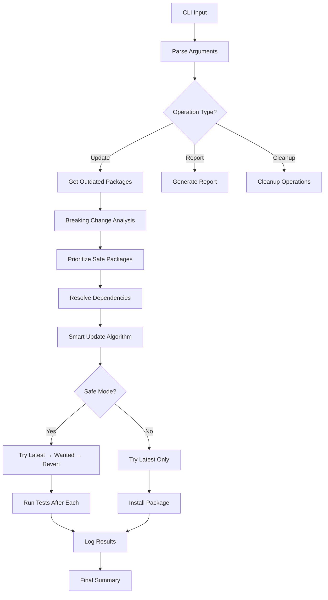

# PackUpdate Architecture

## Overview

PackUpdate features a **modular, KISS-compliant architecture** with comprehensive safety mechanisms, AI integration capabilities, and intelligent package management features.

## Core Principles

### KISS Architecture
- **Single Responsibility**: Each module has one clear purpose
- **Modular Design**: Large functions broken into focused, testable modules
- **Clear Dependencies**: Import structure shows module relationships
- **Easy Debugging**: Issues can be isolated to specific modules

### Safety-First Approach
- **Smart Update Algorithm**: Latest → Wanted → Revert strategy
- **Breaking Change Detection**: Automatic risk assessment
- **Safe Package Prioritization**: Low-risk updates first
- **Comprehensive Testing**: Build and test validation after each update

## Node.js Architecture

### Directory Structure
```
src/
├── types.ts                    # Centralized type definitions
├── updatePackages.ts          # Main entry point (70 lines)
├── utils/                     # Utility modules
│   ├── logger.ts             # Dual logging system (summary + detailed)
│   ├── version.ts            # Version comparison utilities
│   └── cli.ts               # CLI argument parsing & help
└── services/                 # Business logic modules
    ├── packageService.ts     # NPM operations & package management
    ├── dependencyService.ts  # Dependency analysis & resolution
    ├── testService.ts       # Test & build execution
    ├── reportService.ts     # Security & dependency reporting
    ├── updateService.ts     # Update orchestration & smart algorithms
    └── cleanupService.ts    # Package cleanup & optimization
```

### Core Components

#### 🎯 Main Entry Point (`updatePackages.ts`)
- **Responsibility**: Application orchestration and flow control
- **Size**: ~70 lines (reduced from 400+ through refactoring)
- **Functions**: CLI parsing, path validation, operation routing

#### 🔧 Utilities (`utils/`)

**Logger (`logger.ts`)**
- **Dual Logging System**: Summary and detailed logs
- **Summary Log**: High-level events and results
- **Detailed Log**: Full command output, STDOUT/STDERR, debug info
- **Quiet Mode**: Respects console output preferences

**Version (`version.ts`)**
- **Semantic Version Analysis**: Major, minor, patch detection
- **Breaking Change Assessment**: Risk evaluation algorithms
- **Update Compatibility**: Version comparison utilities

**CLI (`cli.ts`)**
- **Argument Parsing**: Flag detection and validation
- **Help System**: Comprehensive usage documentation
- **Special Flags**: Version, type, help handling

#### 🏗️ Services (`services/`)

**Package Service (`packageService.ts`)**
- **NPM Operations**: Install, outdated detection, dependency trees
- **Output Capture**: Full npm command logging
- **Error Handling**: Graceful failure management
- **Version Filtering**: Minor-only, security-only options

**Update Service (`updateService.ts`)**
- **Smart Algorithm**: Latest → Wanted → Revert strategy
- **Safe Prioritization**: Risk-based update ordering
- **Progress Tracking**: Detailed update status reporting
- **Rollback Capability**: Automatic reversion on failure

**Report Service (`reportService.ts`)**
- **Security Analysis**: Vulnerability detection and assessment
- **Breaking Change Detection**: Major version and peer dependency analysis
- **Dependency Intelligence**: Circular dependency detection
- **Comprehensive Reporting**: JSON and console output formats

**Test Service (`testService.ts`)**
- **Script Execution**: npm run build/test with output capture
- **Failure Detection**: Exit code monitoring
- **Output Logging**: Full build/test output preservation
- **Conditional Execution**: Script existence validation

**Cleanup Service (`cleanupService.ts`)**
- **Unused Package Detection**: Depcheck integration with fallback
- **Deduplication**: npm dedupe with statistics
- **Safe Removal**: Conservative unused package elimination
- **Optimization**: node_modules size reduction

**Dependency Service (`dependencyService.ts`)**
- **Update Ordering**: Dependency-aware update sequencing
- **Circular Detection**: Dependency loop identification
- **Resolution Logic**: Conflict resolution algorithms

## Python Architecture

### Directory Structure
```
packUpdate/
├── main.py                   # Entry point with proper imports
├── updatePackages.py        # Main application logic
├── utils/                   # Utility modules
│   ├── logger.py           # Logging utilities with dual system
│   ├── version.py          # Version comparison functions
│   └── cli.py             # CLI argument parsing & help
└── services/               # Business logic modules
    ├── package_service.py  # NPM operations
    ├── report_service.py   # Report generation
    └── cleanup_service.py  # Package cleanup operations
```

### Cross-Platform Consistency
- **Identical Functionality**: Same features across Node.js and Python
- **Consistent CLI**: Same flags and behavior
- **Unified Logging**: Same log format and structure
- **Equivalent Algorithms**: Same smart update logic

## Data Flow Architecture

### Update Process Flow


### Logging Architecture
```mermaid
graph LR
    A[Console Output] --> B[log()]
    B --> C[Console Display]
    B --> D[Detailed Log]
    
    E[High-Level Events] --> F[writeLog()]
    F --> G[Summary Log]
    
    H[Command Execution] --> I[logCommand()]
    I --> D
    
    J[Package Operations] --> K[logPackageOperation()]
    K --> D
    
    L[Test Results] --> M[logTestExecution()]
    M --> D
```

## Feature Architecture

### Breaking Change Detection
```typescript
interface BreakingChangeAnalysis {
  safeUpdates: string[];           // Low-risk packages
  riskyUpdates: string[];          // High-risk packages
  analysis: Record<string, {
    hasMajorVersionChange: boolean;
    riskLevel: 'low' | 'high';
    hasBreakingChanges: boolean;
    migrationRequired: boolean;
  }>;
  peerDependencyIssues: Record<string, any>;
}
```

### Smart Update Algorithm
1. **Risk Assessment**: Analyze each package for breaking changes
2. **Prioritization**: Safe packages updated first
3. **Fallback Strategy**: Latest → Wanted → Current version
4. **Validation**: Build and test after each update
5. **Rollback**: Automatic reversion on failure

### Comprehensive Reporting
```typescript
interface ComprehensiveReport {
  timestamp: string;
  project: string;
  security: {
    vulnerabilities: Record<string, any>;
    vulnerable_packages: string[];
  };
  dependencies: {
    total: number;
    circular: string[];
    outdated: number;
    outdated_list: Record<string, OutdatedPackage>;
  };
  breakingChanges: BreakingChangeAnalysis;
  recommendations: string[];
}
```

## Integration Architecture

### MCP Server Integration
- **AI-Powered Analysis**: Intelligent failure resolution
- **Real-time Progress**: Live update streaming
- **Context Awareness**: Project-specific recommendations
- **Automated Decision Making**: AI-assisted update strategies

### CI/CD Integration
- **Quiet Mode**: Automation-friendly output
- **Exit Codes**: Proper success/failure signaling
- **JSON Reports**: Machine-readable output
- **Log Preservation**: Complete audit trails

## Performance Optimizations

### Modular Loading
- **Lazy Imports**: Load modules only when needed
- **Tree Shaking**: Eliminate unused code
- **Caching**: Intelligent dependency caching
- **Parallel Processing**: Concurrent operations where safe

### Memory Management
- **Stream Processing**: Handle large outputs efficiently
- **Garbage Collection**: Proper resource cleanup
- **Buffer Management**: Optimal memory usage
- **Process Isolation**: Separate npm command execution

## Security Architecture

### Safe Execution
- **Sandboxed Commands**: Isolated npm operations
- **Input Validation**: CLI argument sanitization
- **Path Traversal Protection**: Secure file operations
- **Permission Checks**: Proper access validation

### Vulnerability Management
- **Security Scanning**: Automated vulnerability detection
- **Risk Assessment**: CVE severity analysis
- **Safe Updates**: Security-focused update prioritization
- **Audit Trails**: Complete security logging

## Extensibility

### Plugin Architecture
- **Service Modules**: Easy feature addition
- **Hook System**: Pre/post operation hooks
- **Configuration**: Flexible behavior customization
- **API Compatibility**: Stable interfaces for extensions

### Future Enhancements
- **Custom Rules**: User-defined update policies
- **Integration APIs**: Third-party tool integration
- **Advanced Analytics**: Machine learning insights
- **Distributed Updates**: Multi-project coordination

## Quality Assurance

### Testing Strategy
- **Unit Tests**: Individual module testing
- **Integration Tests**: Cross-module functionality
- **End-to-End Tests**: Complete workflow validation
- **Performance Tests**: Scalability verification

### Code Quality
- **TypeScript**: Full type safety
- **ESLint**: Code style enforcement
- **Documentation**: Comprehensive inline docs
- **Error Handling**: Graceful failure management

This architecture ensures PackUpdate remains maintainable, extensible, and reliable while providing comprehensive package management capabilities.
