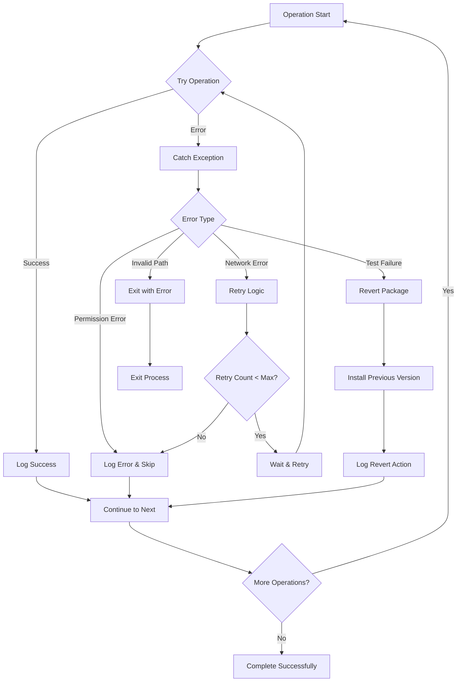

# PackUpdate Architecture

This document provides architectural diagrams showing how PackUpdate works internally and how it integrates with AI assistants through the MCP server.

## System Architecture Overview

## Package Update Flow

## Dependency Resolution Algorithm

## MCP Server Integration Architecture

## MCP Communication Flow

## Data Flow Diagram

## Error Handling Flow

## Key Components

### Core Components
- **Argument Parser**: Handles CLI arguments and flags
- **Project Validator**: Ensures valid Node.js project structure
- **Package Scanner**: Uses `npm outdated` to find updates
- **Dependency Resolver**: Orders updates based on dependencies
- **Update Engine**: Executes package installations
- **Test Runner**: Validates updates with project tests
- **Logger**: Creates detailed audit trails

### MCP Integration
- **Tool Discovery**: Exposes available PackUpdate operations
- **Auto-detection**: Identifies project type automatically
- **Response Formatting**: Structures output for AI consumption
- **Error Handling**: Provides meaningful error messages

### Safety Features
- **Safe Mode**: Tests before permanent installation
- **Rollback**: Reverts failed updates
- **Dependency Ordering**: Prevents dependency conflicts
- **Comprehensive Logging**: Full audit trail for troubleshooting
